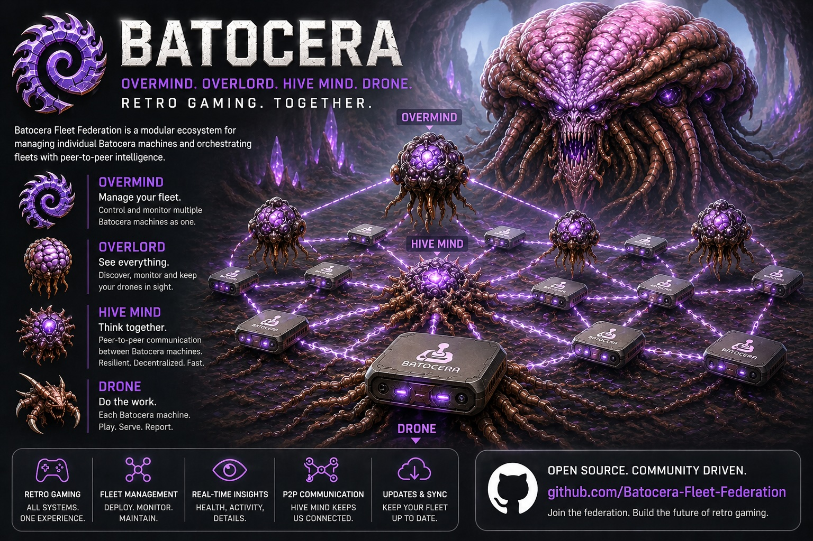

# Batocera Overmind


**Batocera Overmind** is an integration and automation service for Batocera systems.  
A comprehensive system management and game tracking API for Batocera gaming systems. This application allows users to register their Batocera devices, track games played, and manage their game collections.

## TL;DR

- Overmind is the central hub for all of your Batocera Drones.
- Drones check in on a timer, tell Overmind they are alive, and receive the latest swarm list.
- Each Drone can then test direct Drone-to-Drone connectivity and report the result back.
- Overmind shows registered Drones, online/offline status, network details, certificate metadata, telemetry, speed samples, and peer check results.
- Normal Drone management still uses bearer tokens and a pull model, so Overmind does not need to reach into your home network for routine actions.
- Drone-to-Drone API calls can use mTLS with local Drone-created certificates. No public domain is required.
- Docker images and the shared Compose swarm support local testing with multiple realistic Drone containers.
- The Drone-to-Overmind heartbeat interval is 60 seconds by default.
- Local Compose starts without fake data by default and shows unapproved Drone onboarding requests.
- Overmind generates Drone authorization tokens for onboarding; the old integration password flow is deprecated.

**Main features:**

- **Centralized Management:** Connects multiple Batocera devices for fleet management.
- **Remote Actions:** Send commands and manage devices from a central dashboard.
- **Automation:** Schedule and automate tasks like updates, syncs, or maintenance.
- **Integration with Drone:** Works together with Batocera Drone for enhanced admin and monitoring capabilities.
- **Swarm Awareness:** Tracks which Drones are known, online, and reachable by other Drones.
- **Telemetry:** Stores speed samples, filesystem events, peer checks, gameplay events, and ROM/library updates.
- **System Information:** Shows each Drone's latest hostname, platform, Batocera version when available, architecture, CPU, memory, disk, network, uptime, and Docker/runtime indicator.
- **Action Logging:** Tracks all actions and device responses for easy troubleshooting.
- **Secure Communication:** Uses authentication and secure connections for device management.
- **Extensible:** Designed to support future integrations and custom workflows.

## Features

- **User Management**
  - User registration with email and password
  - Secure login with JWT authentication
  - Stub for Gmail OAuth login (future feature)

- **Device Management**
  - Register Batocera devices with detailed system information
  - Track device capabilities (CPU, memory, display, etc.)
  - View all registered devices and their status
  - Show swarm connectivity, peer-to-peer check results, and local certificate metadata

- **ROM/Game Tracking**
  - Upload ROM metadata (system, game name, MD5 hash)
  - Organize ROMs by system and device
  - Track file sizes and paths

- **Game Play Logging**
  - Log games played with timestamps
  - Track play duration
  - View gaming history by device and system

- **Interactive UI**
  - Beautiful web interface for device and game management
  - Real-time device status updates
  - Gaming history visualization

- **API Documentation**
  - Built-in OpenAPI/Swagger documentation
  - Comprehensive endpoint documentation

## Project Structure

```
batocera.overmind/
├── app/
│   └── main.py                  # Script-style entrypoint (like batocera.drone)
├── scripts/
│   └── run_now.sh               # Quick bootstrap and run helper
├── src/
│   └── overmind/
│       ├── __init__.py           # Package initialization
│       ├── main.py               # FastAPI application
│       ├── models.py             # Pydantic models
│       ├── db.py                 # In-memory database
│       └── auth.py               # Authentication utilities
├── pyproject.toml                # Project configuration
├── README.md                      # This file
└── requirements.txt              # Python dependencies
```

## Installation

### Prerequisites
- Python 3.9+
- pip or poetry

### Setup

1. Clone the repository:
```bash
git clone https://github.com/Batocera-Fleet-Federation/batocera.overmind.git
cd batocera.overmind
```

2. Install dependencies:
```bash
python3 -m pip install --user -r requirements.txt
```

Or with development dependencies:
```bash
python3 -m pip install --user -r requirements.txt
python3 -m pip install --user pytest pytest-asyncio httpx ruff black mypy
```

## Running the Application

Start the development server:

```bash
python3 app/main.py
```

The application will be available at:
- **UI**: `http://localhost:8000`
- **API Docs**: `http://localhost:8000/docs`
- **Alternative API Docs**: `http://localhost:8000/redoc`

### Docker

Build the local image:

```bash
docker build -t ghcr.io/batocera-fleet-federation/batocera-overmind:local .
```

Publish a multi-arch GHCR image:

```bash
gh auth login
echo "$GITHUB_TOKEN" | docker login ghcr.io -u <github-user> --password-stdin
./scripts/docker-publish.sh --push
```

The publish script targets `linux/amd64` and `linux/arm64`, tags the next patch version, and updates `latest`. Use `--dry-run` to preview it.

## API Endpoints

### Authentication
- `POST /api/auth/register` - Register a new user
- `POST /api/auth/login` - Login and get access token

### Device Management
- `POST /api/devices/register` - Register a new Batocera device
- `GET /api/devices` - List all devices for user
- `GET /api/devices/{device_id}` - Get device details
- `POST /api/devices/{device_id}/alive` - Drone heartbeat; returns the current swarm list
- `POST /api/devices/{device_id}/events` - Store Drone telemetry events
- `POST /api/devices/{device_id}/peer-checks` - Store Drone-to-Drone health check results
- `POST /api/devices/{device_id}/speed` - Store a Drone speed sample

### ROM Management
- `GET /api/systems` - List systems summary across your devices
- `POST /api/devices/{device_id}/roms` - Upload ROM metadata
- `GET /api/devices/{device_id}/roms` - Get ROMs for device

### Game Play Logging
- `POST /api/devices/{device_id}/gameplay` - Log a game play session
- `GET /api/devices/{device_id}/gamelogs` - Get game play history

### Health
- `GET /health` - Health check endpoint

## Database

Overmind stores collected Drone action metadata in PostgreSQL when database ENV VARs are configured:

- `OVERMIND_DATABASE_URL` or `DATABASE_URL`
- Or component ENV VARs: `OVERMIND_POSTGRES_HOST`, `OVERMIND_POSTGRES_PORT`, `OVERMIND_POSTGRES_USER`, `OVERMIND_POSTGRES_PASSWORD`, `OVERMIND_POSTGRES_DB`

The local Docker Compose file includes a lightweight `postgres:16-alpine` service for fake/demo data.

## Drone Push/Pull Architecture

Drones call Overmind every 60 seconds with an alive payload. That payload includes the MAC-address `device_id`, IPv4/IPv6 connectivity info, API port, protocol, certificate metadata, ROM systems, and system information. Overmind validates the Drone bearer token, stores the latest network state, updates `last_seen`, and marks Drones offline after the offline threshold, which defaults to 180 seconds.

Overmind returns the current swarm list in the alive response. Each Drone stores that list, skips itself, and checks the other Drones through their peer health API. The result says which Drone checked which peer, what address was used, whether it passed, how long it took, and the failure reason if it failed. Overmind stores those results and shows only the latest check per peer on the selected Drone page, using `RESOLVED` or `FAILED` labels.

Overmind never needs an inbound connection to the Drone for normal management. Instead, the Overlord queues actions in Overmind, and each Drone claims one pending action during its alive request. The Drone performs the local work, then posts the action status/result back to Overmind with `Authorization: Bearer <drone_token>`.

Drone tokens are generated by Overmind, stored as hashes, shown raw only once, and can be rotated from the Drone page. Demo mode is available only when `USE_FAKE_DATA=true`.

Per-Drone ROM metadata auto-sync is configured on the Overmind Drone page. The system checkboxes come from ROM systems reported by that Drone.

## Telemetry And Certificates

Drones can send live telemetry events to Overmind, including filesystem create/update/delete events, ROM/library updates, gameplay activity, peer checks, and speed samples. Overmind stores the recent events in its normal storage layer for display and troubleshooting.

For Drone-to-Drone security, each Drone creates or reuses a local self-signed certificate during startup. Overmind stores only safe certificate metadata such as fingerprint, subject, issuer, serial number, SANs, validity dates, and renewal status. It does not receive the Drone private key.

These certificates are for Drone-to-Drone peer API calls. Drone-to-Overmind calls continue to use the existing bearer token pattern.

For local swarm testing, use the shared `.github` repo:

```bash
.github/scripts/import-batocera-test-data.sh
.github/scripts/swarm-up.sh
.github/scripts/swarm-status.sh
.github/scripts/run-integration-tests.sh
.github/scripts/swarm-down.sh --volumes
```

ROM test data must live under `.github/data/roms/<system>/<files>`. Each Drone container copies a different subset into its own `/userdata/roms` folder, which makes ROM-difference testing possible. If downloads return `{"error": "not found"}`, confirm the source file exists in the configured ROM root and that the URL uses the ROM `unique_id`.

The local swarm runs four lightweight Drone containers. Each has a unique device id, hostname, MAC address, port, and Docker volume. Set `USE_FAKE_DATA=true` only when you intentionally want demo/preconfigured data.

## Onboarding And ROM Sync

When a new Drone reaches Overmind, it appears as **Psionic connection detected** until the Overlord approves it. Generate a Drone authorization token in Overmind, paste it into the Drone admin Overmind Integration page with the Overlord email, and start integration.

Overmind builds a master ROM list from all approved Drones. The selected Drone page shows which swarm ROMs are present or missing on that Drone. You can request a ROM or whole system sync without choosing a source Drone. The target Drone automatically chooses a healthy peer using peer checks and recent speed samples, downloads ROMs one at a time over Drone-to-Drone mTLS, and reports activity back to Overmind.

For mTLS trust, Overmind exposes approved peer public certificates to approved Drones only. Drones cache those certificates locally and refresh once after unknown-CA or certificate mismatch failures.

## Batocera Device Registration

The Batocera drone app can register a device by sending:

```bash
curl -X POST "http://localhost:8000/api/devices/register" \
  -H "Content-Type: application/json" \
  -d '{
    "email": "user@example.com",
    "password": "password123",
    "device_id": "unique-device-uuid",
    "device_name": "My Arcade Cabinet",
    "batocera_info": {
      "model": "Batocera DevBox",
      "system": "Linux 6.6.0",
      "architecture": "x86_64",
      "cpu_model": "AMD Ryzen 7 7800X3D",
      "cpu_cores": 8,
      "cpu_threads": 16,
      "cpu_max_frequency": "5.00 GHz",
      "temperature": "51 C",
      "memory_available": "25.4 GiB",
      "memory_total": "32 GiB",
      "display_resolution": "1920x1080",
      "display_refresh_rate": "60 Hz",
      "data_partition_available": "812 GiB",
      "ip_address": "192.168.1.123",
      "battery": "N/A"
    }
  }'
```

## Example Usage

### 1. Register a User
```bash
curl -X POST "http://localhost:8000/api/auth/register" \
  -H "Content-Type: application/json" \
  -d '{
    "email": "user@example.com",
    "password": "securepassword123",
    "full_name": "John Doe"
  }'
```

### 2. Login
```bash
curl -X POST "http://localhost:8000/api/auth/login" \
  -H "Content-Type: application/json" \
  -d '{
    "email": "user@example.com",
    "password": "securepassword123"
  }'
```

### 3. Register Device (using email/password auth)
```bash
curl -X POST "http://localhost:8000/api/devices/register" \
  -H "Content-Type: application/json" \
  -d '{
    "email": "user@example.com",
    "password": "securepassword123",
    "device_id": "device-uuid-123",
    "device_name": "Living Room Arcade",
    "batocera_info": {...}
  }'
```

### 4. Upload ROM Metadata
```bash
curl -X POST "http://localhost:8000/api/devices/device-uuid-123/roms" \
  -H "Authorization: Bearer YOUR_TOKEN" \
  -H "Content-Type: application/json" \
  -d '{
    "device_id": "device-uuid-123",
    "system_name": "snes",
    "roms": [
      {
        "rom_name": "Super Mario Bros",
        "rom_md5": "aabbccdd112233445566778899aabbcc",
        "file_path": "/roms/snes/Super Mario Bros.zip",
        "file_size": 409600
      }
    ]
  }'
```

### 5. Log Game Play
```bash
curl -X POST "http://localhost:8000/api/devices/device-uuid-123/gameplay" \
  -H "Authorization: Bearer YOUR_TOKEN" \
  -H "Content-Type: application/json" \
  -d '{
    "device_id": "device-uuid-123",
    "system_name": "snes",
    "game_name": "Super Mario Bros",
    "duration_seconds": 1800
  }'
```

## Future Features

- [ ] Gmail OAuth integration
- [ ] Real database backend (PostgreSQL/MongoDB)
- [ ] WebSocket support for real-time updates
- [ ] Bulk ROM import
- [ ] Gaming statistics and trends
- [ ] Multi-user device sharing
- [ ] Device remote management
- [ ] Game collection validation
- [ ] Achievements system
- [ ] Mobile app support

## Security Notes

⚠️ **IMPORTANT**: This is a development version. Before deploying to production:

1. Change the `SECRET_KEY` in `auth.py`
2. Enable HTTPS
3. Use a real database
4. Implement rate limiting
5. Add CORS restrictions
6. Use environment variables for sensitive data
7. Implement request validation middleware
8. Add comprehensive logging

## Contributing

Contributions are welcome! Please feel free to submit a Pull Request.

## License

MIT License - see LICENSE file for details

## Support

For issues, questions, or suggestions, please open an issue on GitHub.

---

Made with ❤️ for the Batocera community
